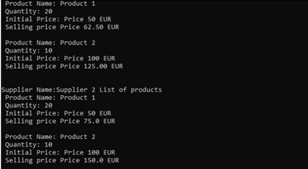

# C# OSNOVE  OOP & SOLID

## Zadatak

Cilj ovoga zadatka je vežba objektno-orijentisanih principa.

Potrebno je kreirati novi solution u Visual Studio-u koji će sadržati glavni projekat baziran na .Net Core projektu.

Potrebno je kreirati konzolnu aplikaciju koja će prikazati listu dostupnih proizvoda i njihovih cena kod svakog od dobavljača. Svaki proizvod je opisan jedinstvenim indentifikatorom, imenom, količinom, obeležjem da li je proizvod dostupan ili ne, inicijalnom i prodajnom cenom. Proizvod je dostupan samo ako je imate jedan ili više proizvoda na stanju. Svaki dobavljač je opisan jedinstvenim indentifikatorom, imenom, listom proizvoda i vrednosti marže koju sam dobavljač uzima na svakom proizvodu.

_**Napomena: Finalan broj proizvoda ne zavisi od toga da li se ista instanca proizvoda nalazi kod različitih proizvođaća. Cilj ove aplikacije da je da se prikažu cene proizvoda kod različitih dobavljača.**_

