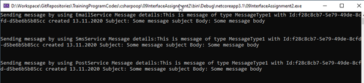

# C# OOP & SOLID

Potrebno je kreirati konzolnu aplikaciju koja će simulirati slanje različitih vrsta poruka putem različitih tehnologija slanja.

Svaka poruka je opisana jedinstvenim indentifikatorom, datumom i vremenom kreiranja, naslovom i telom poruke. Jednistveni indentifikator se genereše prilikom kreiranja instance poruke. Zbog jednostavnosti sam proces slanja poruka simulirati jednostavnim konzolnim ispisom, ali smatrati da se oni u suštini razlikuju, primer:

```
This is message of type [Message Type Name] with Id:[Id] created [20.10.2020] Subject: [Subject] Body: [Message] 
```

Primer izvršavanja glavnog programa:

